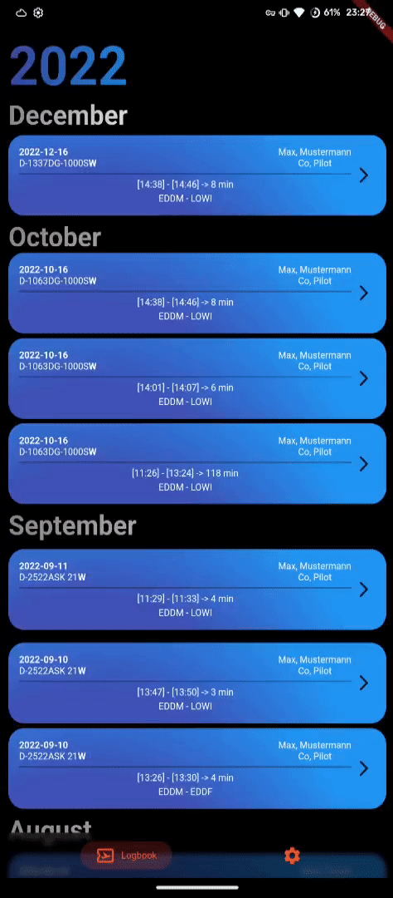

#  logbuchheftle_flutter

Frontend des `LogbuchheftleServer`s. Eine elektronische Möglichkeit sein Logbuch zu führen.

## NOTE: Fehlende Features
Bislang fehlen noch ein paar Features bis zum Release:
- Lokale Speicherung des Logbuchs
- Settings Page
- Optional: TimeCalculator
